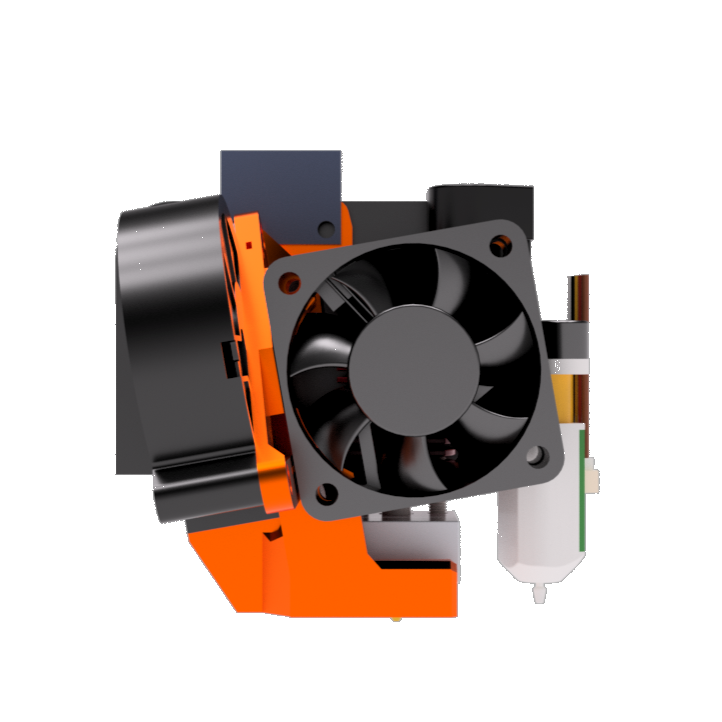

# FrankEnstein-Duct
*Frankenstein also known as Frank Enstein is a light weight fanduct for the Ender 3 or similar printers. It adds a 5015 blower fan and is also compatible with a wide range of Hotends and Extruders.*

### Don't we have enough fan ducts for the Ender 3? Yet another one...?

Yes, another one! And I'll tell you why. Frank is also known as Frankenstein because it's not beautiful or aesthetic (I like the look a lot, though), but is reduced to sheer fun. There is no plastic that is not really necessary. This makes Frank very lightweight, but also quick to print and easy to repair. The simplicity of the duct allows for a very wide range of hotends and extruders, as there is no plastic to get in the way. With only 4 printed parts you get a new powerful duct for your Ender 3!

 

---

### Supported Hotends, Extruders and additional Hardware

This section lists all compatible Hotends and Extruder. If you're missing your hotend or extruder, feel free to post a request for that on my Discord. Let us create the first Fan Duct, that support <i>almost*</i> **everything**! (*Please not the Limitations section below)

#### Hotends
    1.  Stock Mk8 
    2.  Phaetus - Dragonfly BMS     (6 anf 7 fin version (see below))
    3.  Phaetus - Dragonfly BMO     (with V6 mount, rigid mount will be added soon)
    4.  Phaetus - Dragon            (Standard Flow and High Flow)
    5.  Phaetus - Dropeffect XG
    6.  Phaetus - Rapido HF/UHF     (not public yet but available on my Discord)
    7.  E3D - V6
    8.  E3D - V6 Vulcano
    9.  E3D - Revo 6
    10.  E3D - Revo Micro
    11. E3D - Revo Voron
    12. Haldis - Red Lizard         (with stock version)
    13. Creality - Spider Hotend    (with BMS 7 version)
    
Hotends links: [Dragonfly BMS](https://www.phaetus.com/dragonfly-bms/), [Dragonfly BMO](https://www.phaetus.com/dragonfly-bmo/), [Dragon](https://www.phaetus.com/dragon-st/), [Dropeffect XG](https://dropeffect.phaetus.com/products/xg-hotend), [V6](https://e3d-online.com/products/v6-all-metal-hotend), [V6 Vulcano](https://e3d-online.com/products/volcano-hotend), [Revo 6](https://e3d-online.com/products/revo-six), [Revo Micro](https://e3d-online.com/products/revo-micro), [Revo Voron](https://e3d-online.com/products/revo-voron), [Red Lizard](https://aliexpress.com/item/1005003366657998.html)

#### Extruders
    1. Bowden extruders             (stock or any replacement you're using)
    2. Annex's - Sherpa Mini        (With adapter also Sherpa Micro)
    3. Róbert's - Orbiter V2.0
    4. Bondtech - LGX Lite
    5. Triangelab - TBG Lite

Extruder links: [Sherpa Mini](https://www.https://github.com/Annex-Engineering/Sherpa_Mini-Extruder), [Sherpa Micro](https://github.com/Annex-Engineering/Sherpa_Micro-Extruder), [Orbiter V2.0](https://www.https://orbiterprojects.com/orbiter-v2-0/), [LGX Lite](https://www.bondtech.se/product/lgx-lite-large-gears-extruder/), [TBG Lite](https://www.aliexpress.com/item/1005003908281100.html)

#### Hardware
    1. BL-Touch and Clones
    2. ADXL345-Accelerometer (for Klipper and RepRap) 

Hardware links: [BL-Touch](https://www.antclabs.com/bltouch-v3), [ADXL345 Sensor (Klipper)](https://www.klipper3d.org/Measuring_Resonances.html)

---

### Bill of Material: Hardware you need
<table>
    <tr>
        <td>Component</td>
        <td>Quantitiy</td>
        <td>Reuse from Printer</td>
        <td>Notes</td>
    </tr>
    <tr>
        <td>5015 Blower fan</td>
        <td>1</td>
        <td>No</td>
        <td>For ABS machines Winsinn works okay. Otherwise consider Delta, Sunon or Gdstime. </td>
    </tr>
    <tr>
        <td>4010 Axial Fan</td>
        <td>1</td>
        <td>Yes</td>
        <td>You can reuse the stock fan. You can also use 4020 fans, that's up to your preference.</td>
    </tr>
    <tr>
        <td>M3x16mm</td>
        <td>4</td>
        <td>No</td>
        <td>To mount the 4010 and the fanguide to the 4010</td>
    </tr>
    <tr>
        <td>M3x18mm</td>
        <td>2</td>
        <td>No</td>
        <td>To mount the 5015.</td>
    </tr>
    <tr>
        <td>M3x12mm</td>
        <td>2</td>
        <td>No</td>
        <td>To mount the Cable Clip. BL-Touch mount needs M3x16mm.</td>
    </tr>
    <tr>
        <td>M3x8mm</td>
        <td>2</td>
        <td>Yes/No</td>
        <td>To mount the 5015 holder. The stock ones have only a very few mm to grab, 8mm is better.</td>
    </tr>
    <tr>
        <td>M3x5x4mm heat inserts</td>
        <td>10</td>
        <td>No</td>
        <td></td>
    </tr>
</table>

---

### STL's (3mf) you need:
The STL folder has 3 sub folders which stores the files you need to build this duct:
    - **CommonAll**: Printed Parts that are common with all configurations. Currently this is only the BL-Touch mount.
    - **Hotend**:    Each hotend has it own folder, just pick the files for your hotend.
    - **Extruder**:  Just pick the extruder you want to use and then the hotend. 
You should end up with a Duct, a 5015 holder (+ clamp for V6) and a fan guide. The LGX Lite and the TBG Lite also add a sperate mount, same for the BL-Touch.
**Print settings: 55% Infill, 5 Walls,Tops and Bottoms**

#### Extras
The Extras folder contain some specials you can add to the fan duct if you want, but of course these aren't needed. Just read the details for each extra.

### Credits
Thanks to all the awesome Users from my Discord that tested this duct over and over angain. Special thanks to Oldcrazy for all his ideas and mods. Thanks to Thomas for the name.

---

### Limitations
Even though this Duct has a very high range of supported Hotends and extruders, there're still some limitations, due to the design or the time I had spent on this design

#### 1. Fit's only the stock plate
    
##### a) MGN:</dt>
- Oldcrazy from my Discord made a MGN version. Will be uploaded soon - you can get it from my Discord in the meantime.
            
##### b) Non-Ender 3 Printers:
- This Duct resuses the hotend-mounting-standoffs aand the two M3-thread holes on the left where the stock cover is attached to. If your printer doesn't have these you can get a x-plate like the Ender 3 one very cheap in [Ali](aliexpress.com/item/1005001315276573.html?) or with some luck second hand locally.
Please note that eveen the Ender 3 S1 uses a different plate which doesn't have the required holes.
            
            
#### 2. No support for Mosquito or mosquito clone

- Aside the fact I want support Slice for [reasons](https://www.reddit.com/r/VORONDesign/comments/rpyqpq/voronslice_beef/), the heaterblock of the Mosquito is just too big, and won't allow any cooling from the front (the duct would be way too far away for any cooling effect). 
        
#### 3. Two side cooling
    
- I already got some requests for a dual 5015 version, which would allow 3 or 4 sided cooling, but in my opionon that would be an overkill. With the speeds we reach with the Ender 3 a single 5015 is more than enough. I want to explain why:
        
##### a) Print speeds:

- I know fast printing got very popular, but even with 300 or 400mm/sec print speed the single 5015 is more than enough. Even though you print with high speeds, external and briging parameters are still kinda slow. We all fo fast on the infill but not for the externals because that results in poor quality and printing tolerances. Less cooling on the infill also means better layer adheasion.
            
##### b) 5015 ≠ 5015:

- There're many brands of 5015 fans out there. When you look for a 5015 on Amazon Winsinn is probably the first result you get. Before you install a dual 5015 with two Winsinn fans, just build a proper single 5015 setup. Winsinn fans are very weak, while Delta or Sunonfans are pretty much the best you can get. Somewhere inbetween are fans by GDstime. In the end you have to pick a fan that fits your requirements. I print ABS only so I don't need much cooling and also use a Winsinn. If you print a lot of PLA you should consider one of the just named brands.

### Changelog:

05.02.2023: Some fixes:
    - 5015 holder got an additinal hole to fit the Ender 3 V2 mounting holes
    - Overhang on the 5015 holder is less steep now, makes printing easier.
11.12.2022: Initial Release 