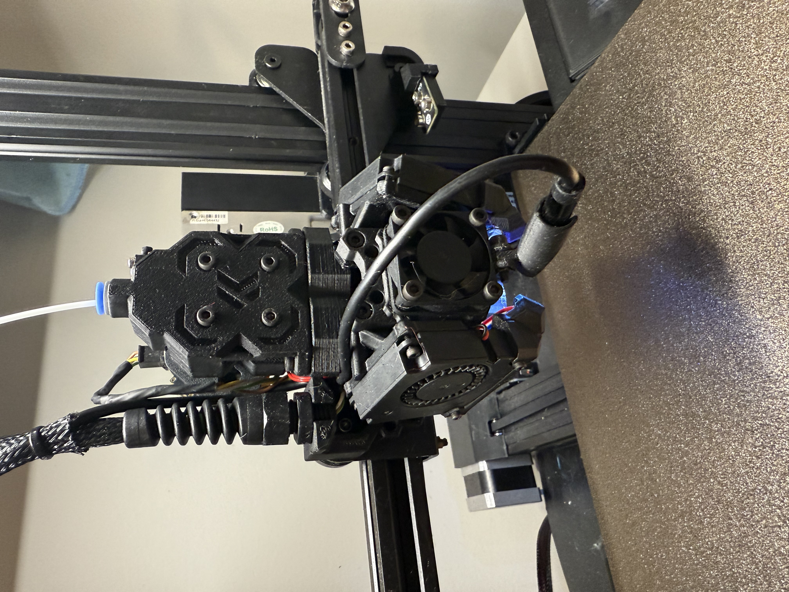

Add a nozzle camera to your Ender!

I picked up a cheap endoscope off Temu and needed a way to mount it. This is a plate that is sandwiched between the hotend mount and 3010 fan or 4010 adapter. It gives a simple mounting point to add your favorite accessory. All you need is an M3 bolt and M3 nut. The screws that mount your 3010 fan or 4010 adapter might need to be a tad bit longer.

The included camera mount is for an endoscope that is 7.4mm in diameter. It is held in with a friction fit, the cutout portion allows for tight fit by flexing to accomodate the camera. CAD file is included if you want to modify for other size camera or other accessory.

STLs are oriented for how I printed the parts. For strength, I printed the camera mount on it's end. It printed fine for me, but it does have a small bed contact area so it might test your bed adhesion. I can see some setups would need to enable a brim in the slicer, but it did print successfully for me without. YMMV.

