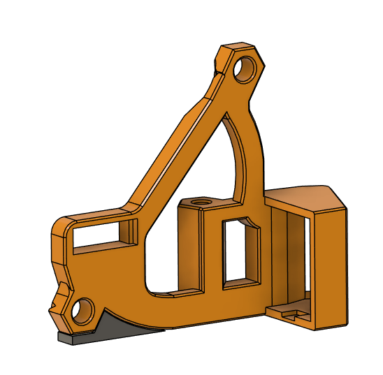
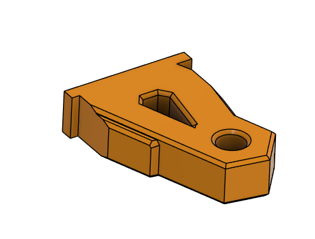
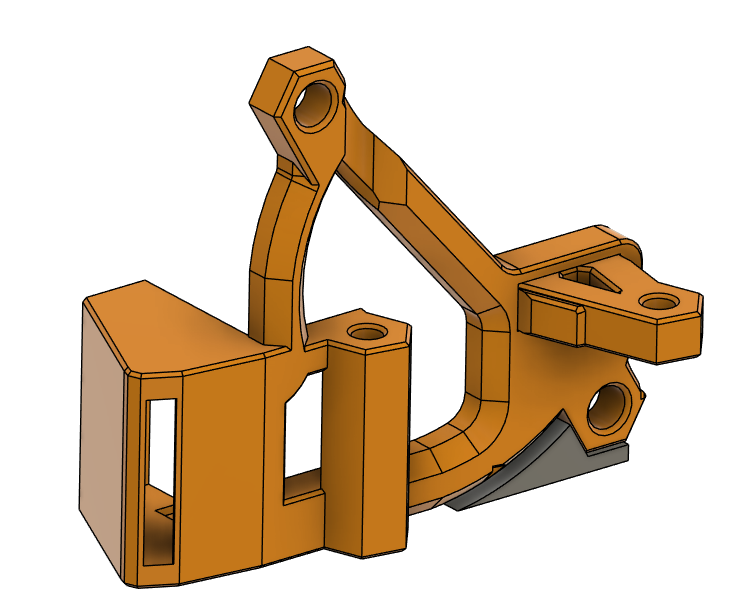
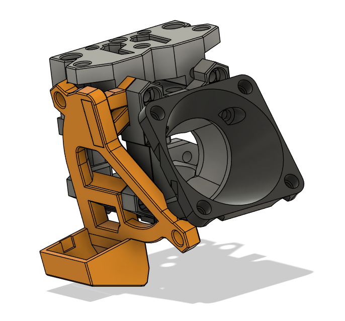
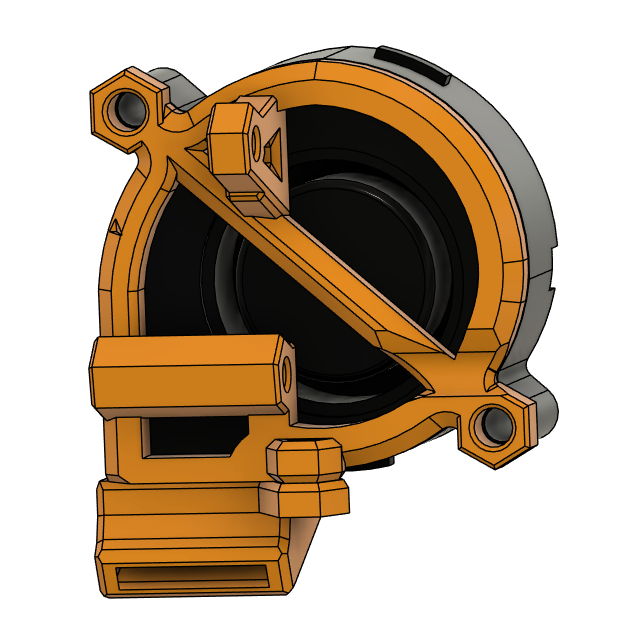
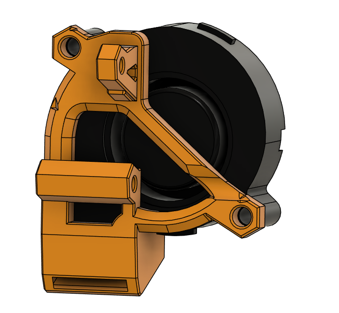

This mod combines the 5015 holder and duct into a single piece to aid with duct drooping and fitment to the fan, while also removing a heat insert and bolt which would otherwise be needed for attaching the duct to the mount. An integrated wedge support piece is included to remove the need for adding slicer generated supports.

The model is fully printable without supports, although the top side of the duct can come out stringy but will still work fine after removing the hanging filament.

The LHS is the base printable file and to print the RHS, the mount and bracket should be mirrored in the slicer.

The mount is designed to be oriented in the slicer like this (grey element is integrated support):

The bracket is held in place with a notch integrated into the mount, as well as the fan when it is installed, so there is no need for any additional hardware.

The bracket should slide easily into the slot in the mount (take note of orientation of bracket in the mount):

The additional material around the bracket may intrude a bit on the intake of the fan on the right hand side, but not a significant amount more than the original holder.

Original Holder:

AIO Mount:

