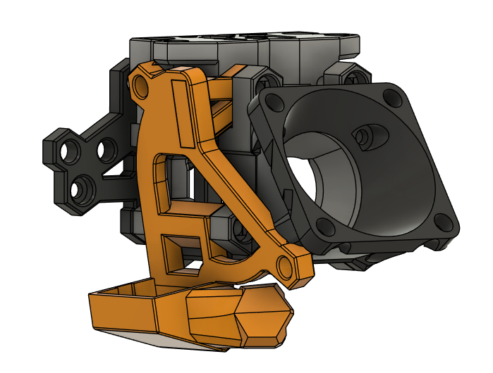

This mod adds LED holders to the AIO 5015 duct. It is compatible with the same wedge support in the base duct.

The model is fully printable without supports, although the top side of the duct can come out stringy but will still work fine after removing the hanging filament.

The LHS is the base printable file and to print the RHS, the mount and bracket should be mirrored in the slicer.

Orientation is the same as the base AIO Duct. Refer to the base AIO instructions [here](../AIO%205015%20Ducts/README.md) for printing instructions.

