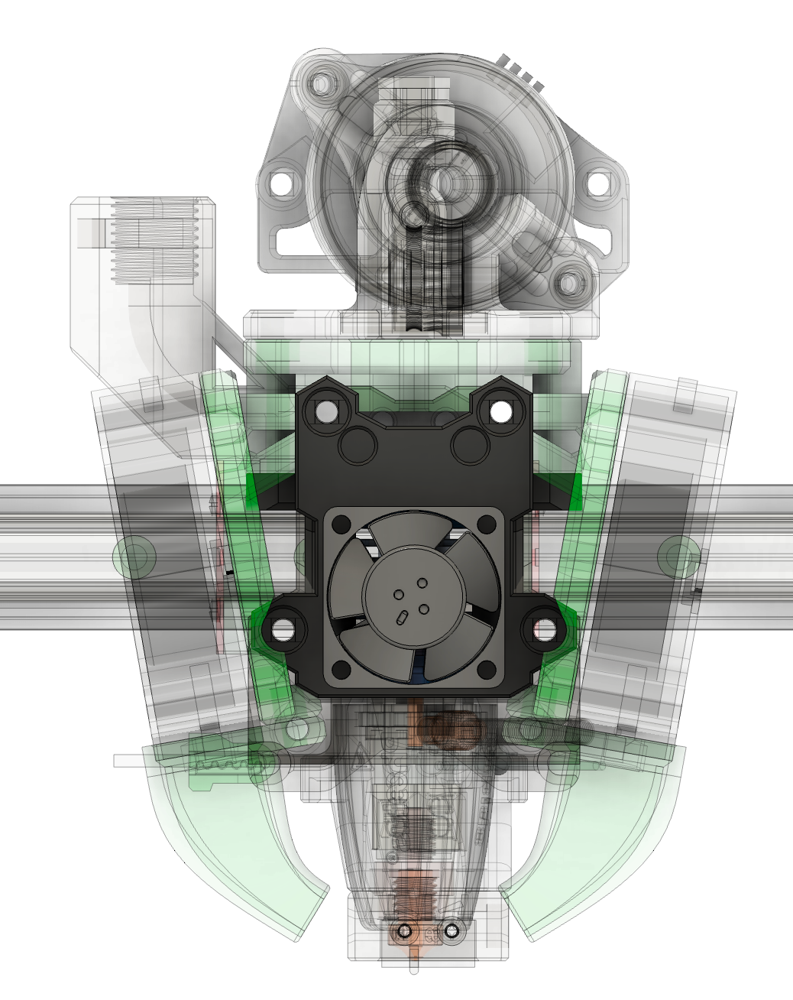
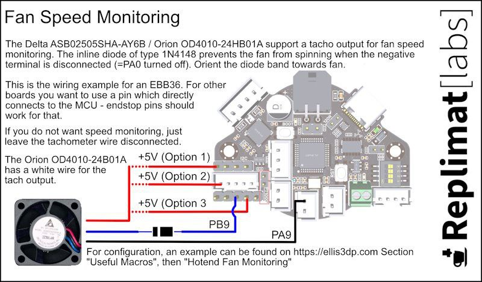
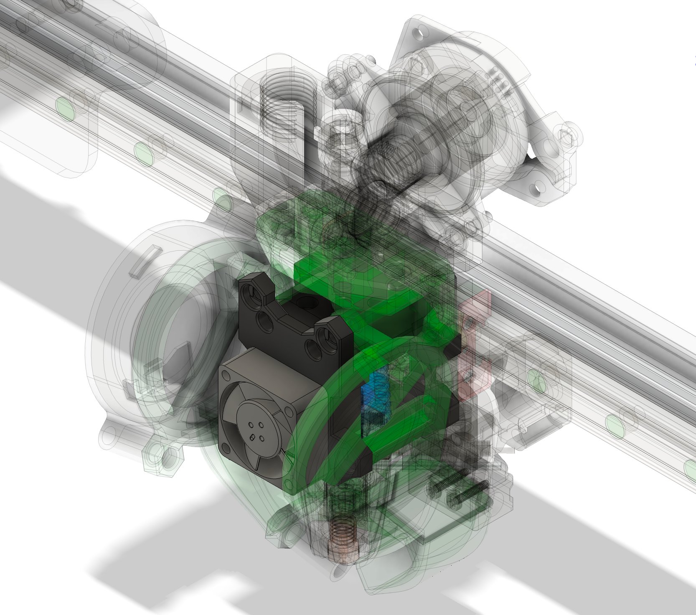

## 2510 Fan Mount for Dragon mount hotends

### Description

2510 tend to be less prone to clog on Dragons and similar hotends, so it's a nice upgrade to have on Frank

### BOM

- 4x M2.5X14mm screws (16mm should work too)
- 2510 Fan (Delta Electronics 5v ASB02505SHA-AY6B preferred)

### Assembly

Should be the same as 3010 version, I made assembly somewhat easier but it should be straightforward anyway.

### Delta 5v installation guide (for EBB36/42) borrowed from Replimat labs:

### Other Images:

