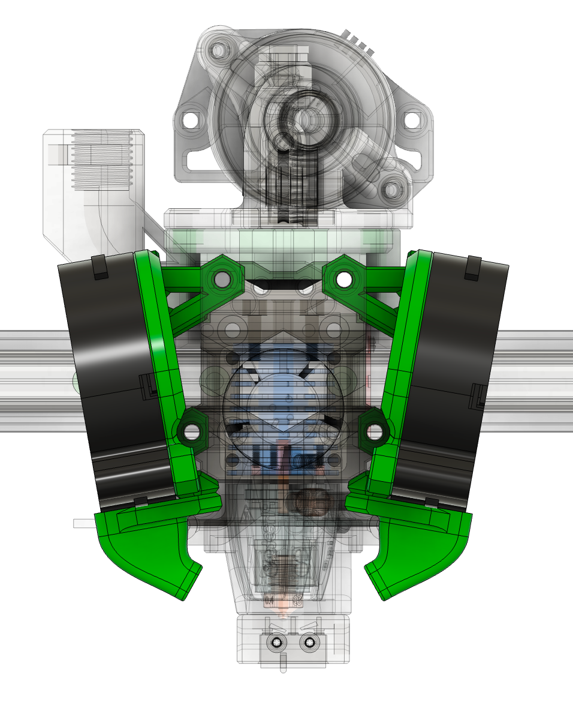

## 5015 HF Ducts

### Description

Longer ducts inspired by LH Stinger to work with volcano (or 8.5mm longer) versions of supported hotends and others, like Rapido HF

### BOM

The same as normal ducts

### Assembly

The same as normal ducts

### Other Images:

