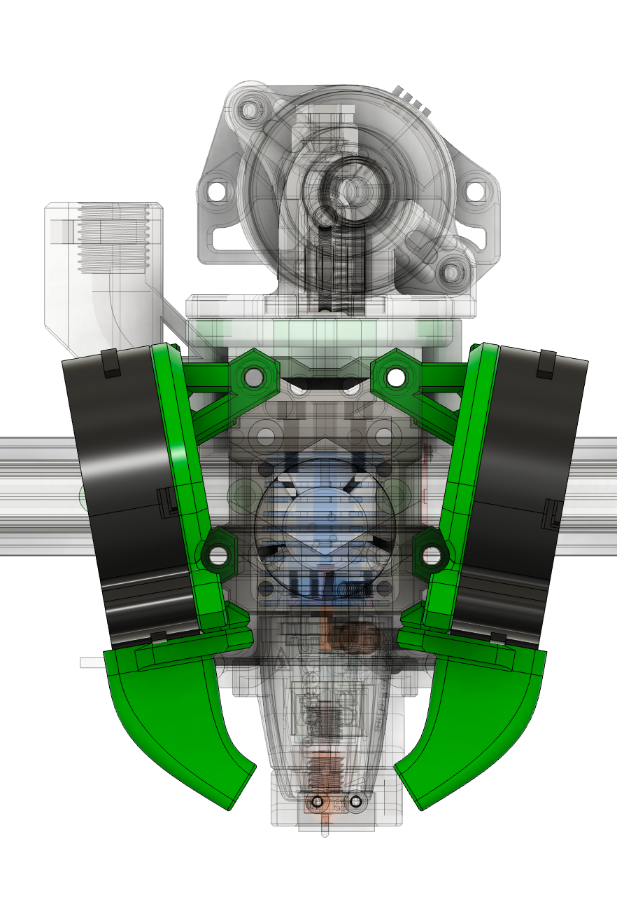
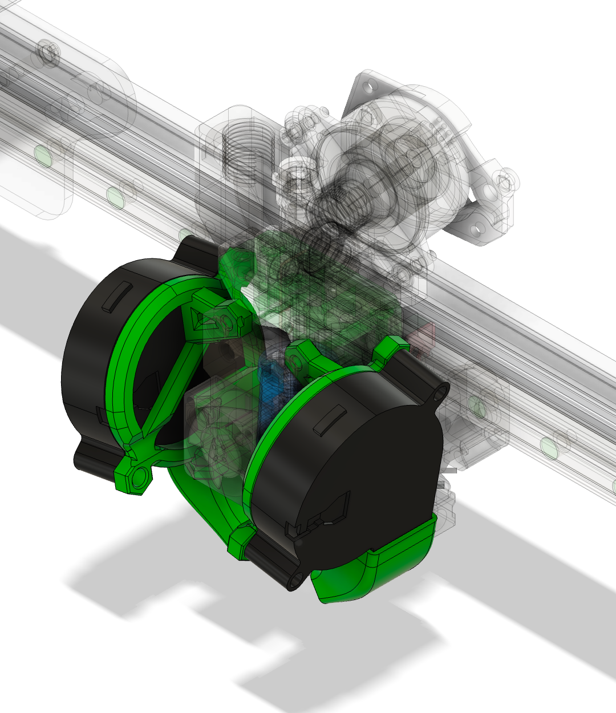

## 5015 UHF Ducts

### Description

Longer ducts inspired by LH Stinger to work with supported hotends with long meltzone (17mm longer than Dragon and similar) and others, like Rapido UHF

### BOM

The same as normal ducts

### Assembly

The same as normal ducts

### Other Images:

