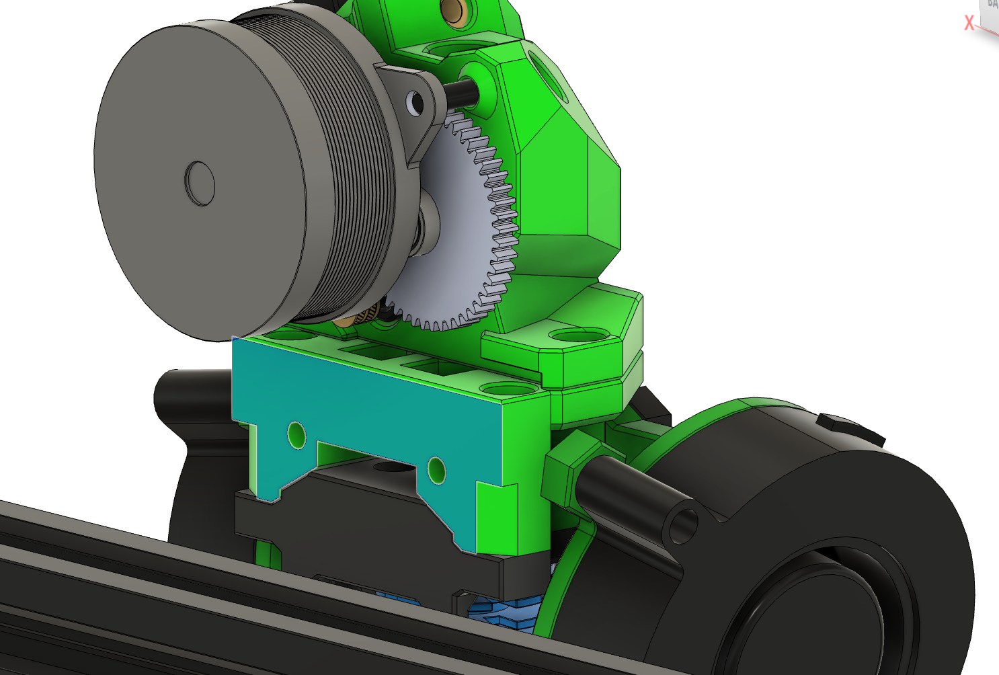
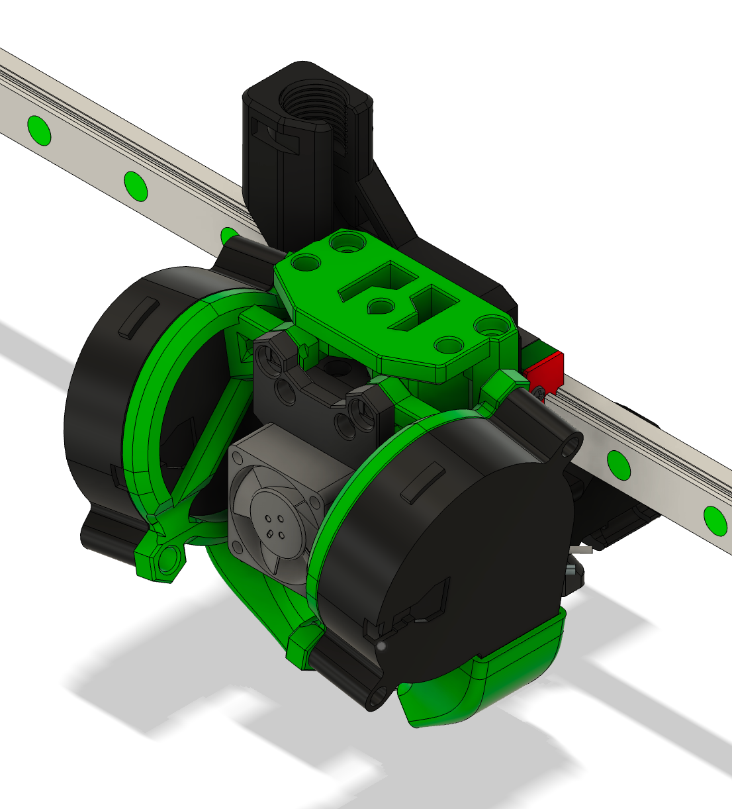
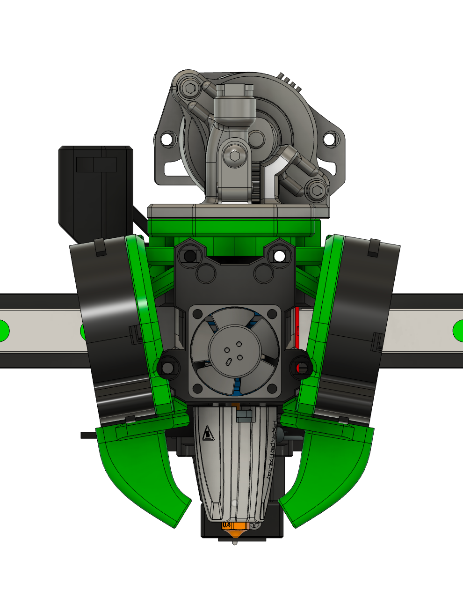
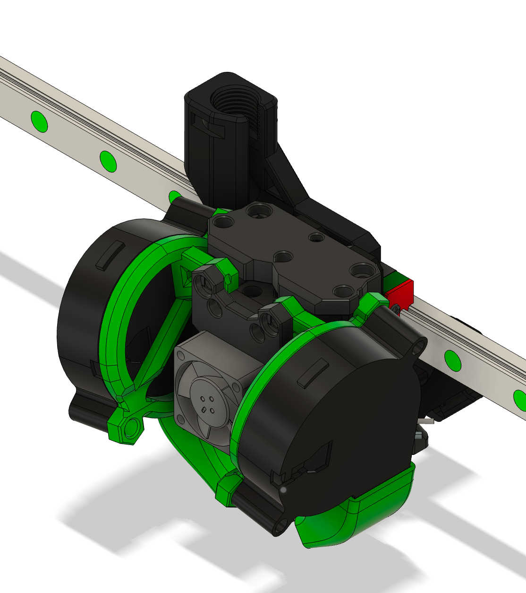
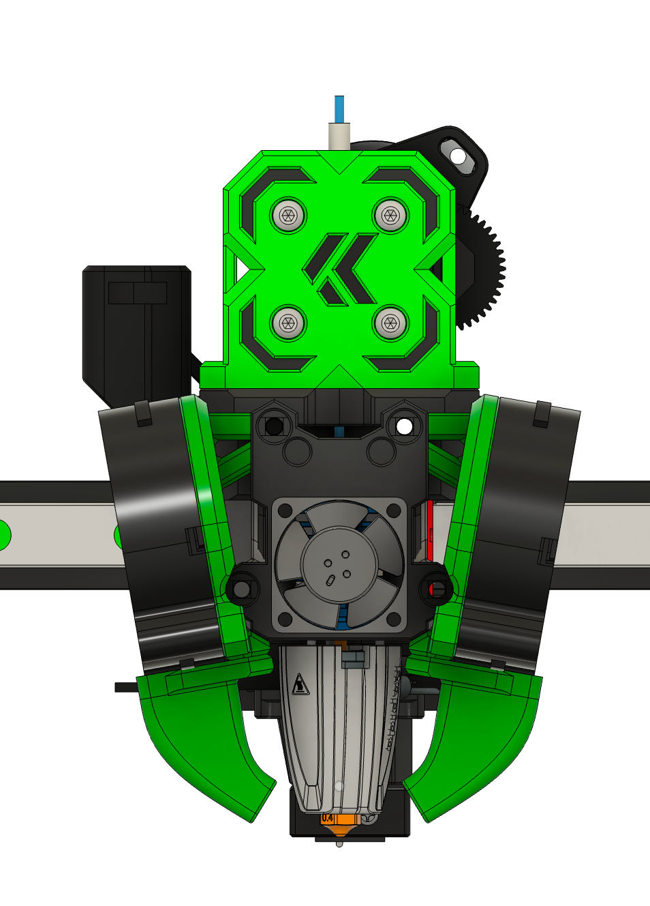
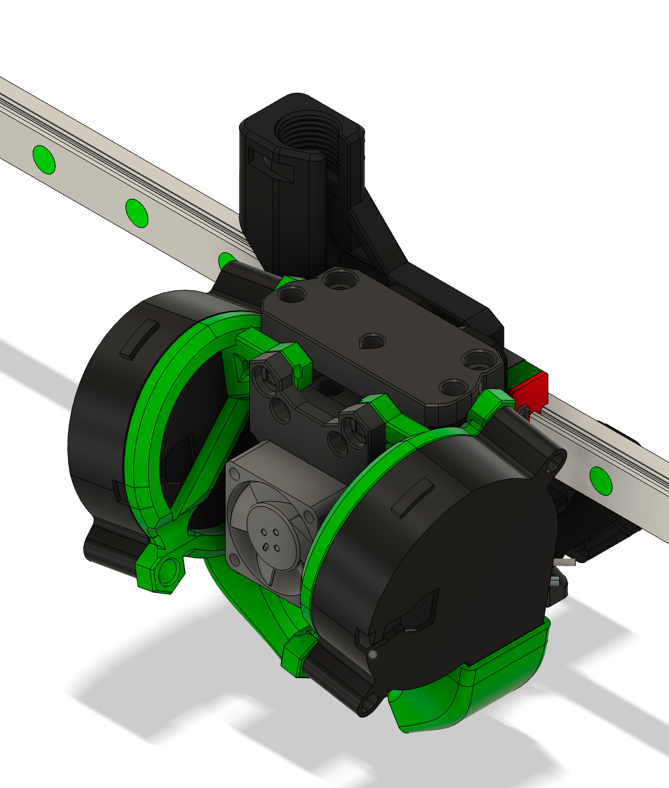
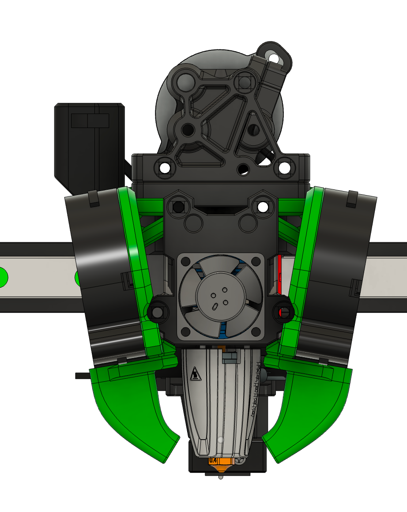

## Extruder Mounts

### Description

Assortment of extruder mounts I made with some minor improvements:

- LowBoi (Orbiter mount)
- Papilio Lite (3 screw, alternative mount using a nut at rear)
- WWMBG (Orbiter mount)
- Protoxtruder 2

### BOM

Same as normal, except M3 Hexnut for Papilio Lite mount

### Printing

Designed to be printed laying on this face:

### Assembly

The same as normal mounts

### Images:

#### LowBoi

#### Papilio Lite

#### WWMBG

#### Protoxtruder

