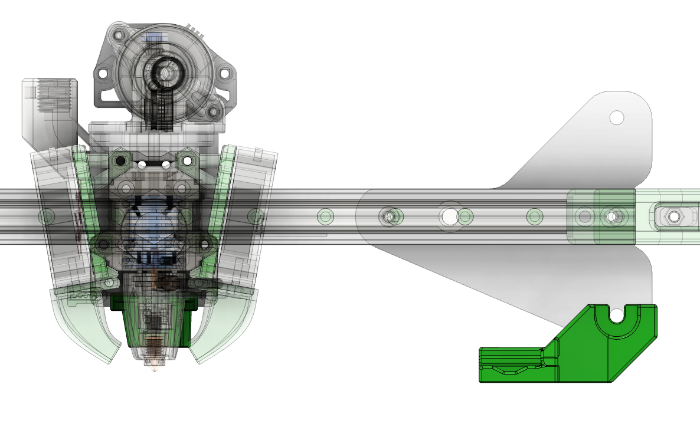
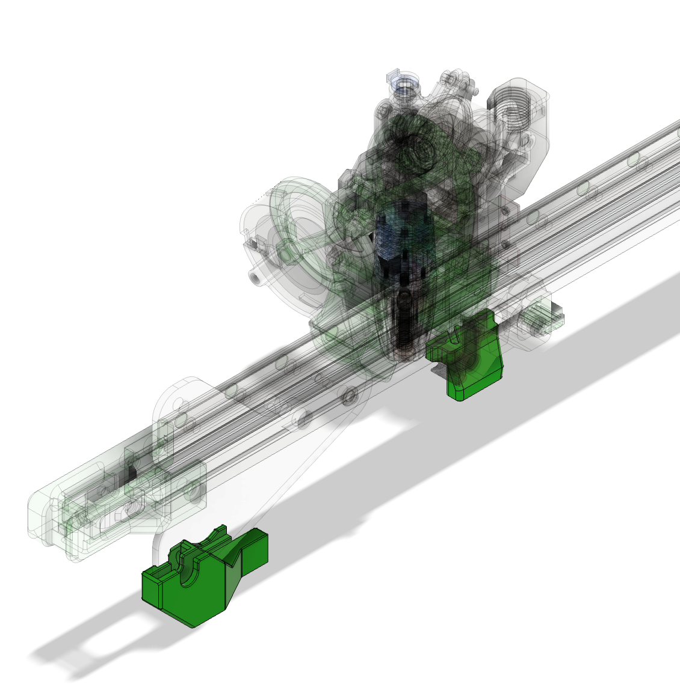

## Klack UHF

### Description

Klack dock and mount (for MGN12H carriage) designed to work with UHF ducts. Designed to be used with Klack R2.2 

### BOM

The same as normal dock and mount

### Assembly

The same as normal dock and mount

### Other Images:

