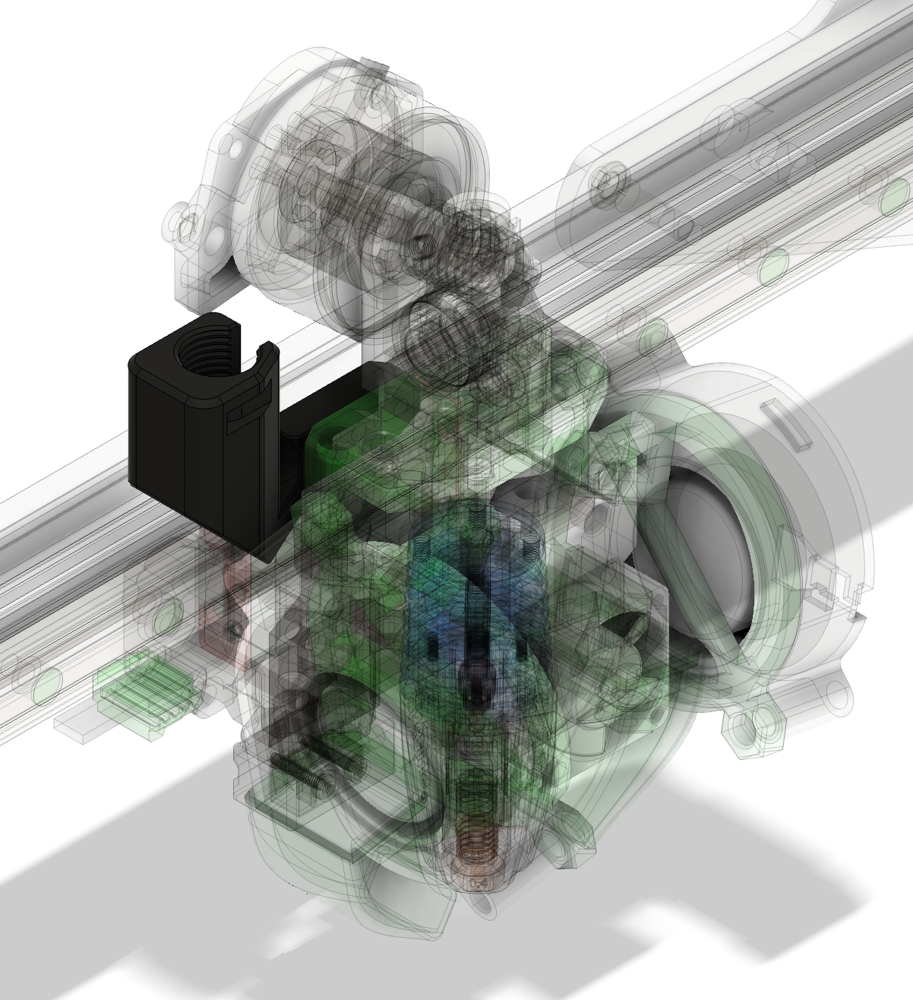
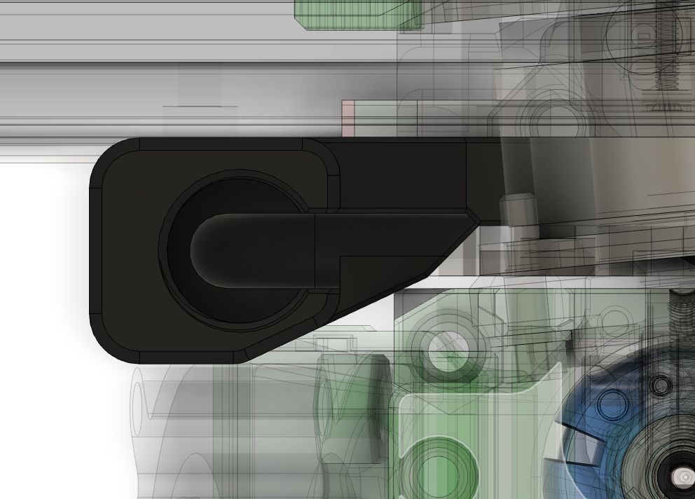

## PG7

### Description

Stiffer version of PG7 Mount. It has some room for wiring and allows fixing thread with a tie

### BOM

- PG7 Cable Gland

### Assembly

Insert cable to gland, screw the gland onto mount

### Other Images:

