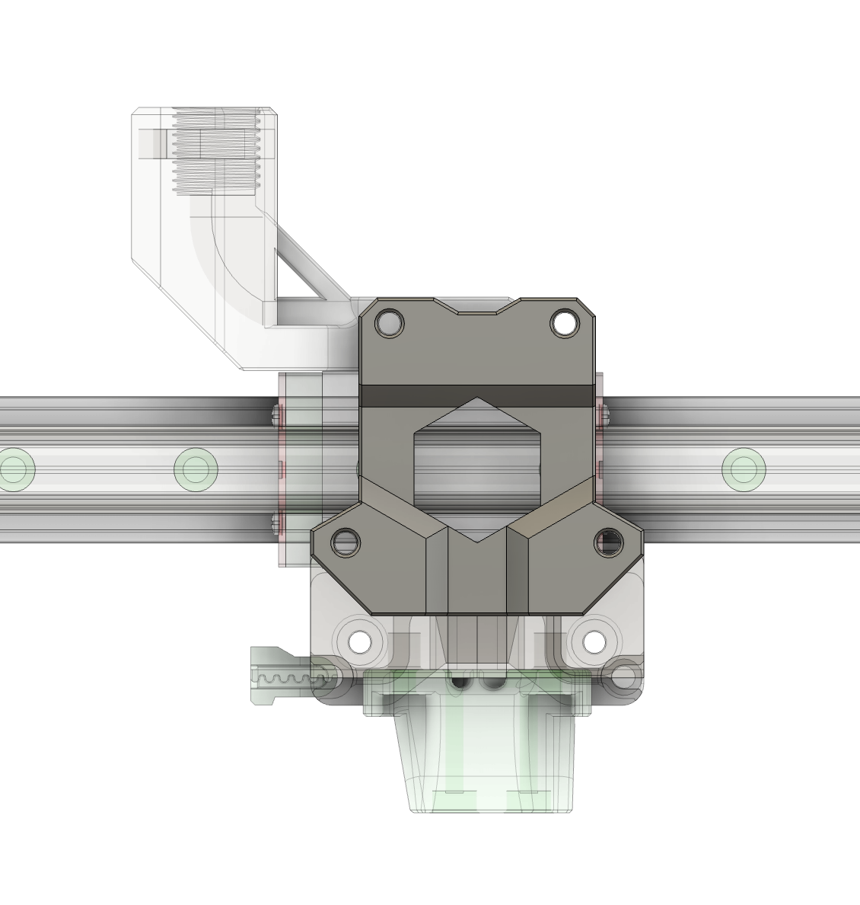
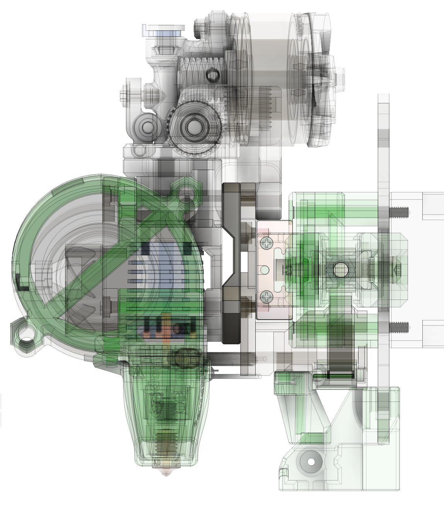

## Toolhead spacer

### Description

5mm spacer for MGN12H carriage mounting. Useful when you can sacrifice some Y (or have extra space) and want to use longer extruder with toolhead board (e.g. G2SA, Orbiter, LowBoi etc)

### BOM

- 4x M3x40mm (5mm longer than original BOM)

### Assembly

Slap it onto hotend mount at rear side and mount whole assembly onto carriage

### Other Images:

